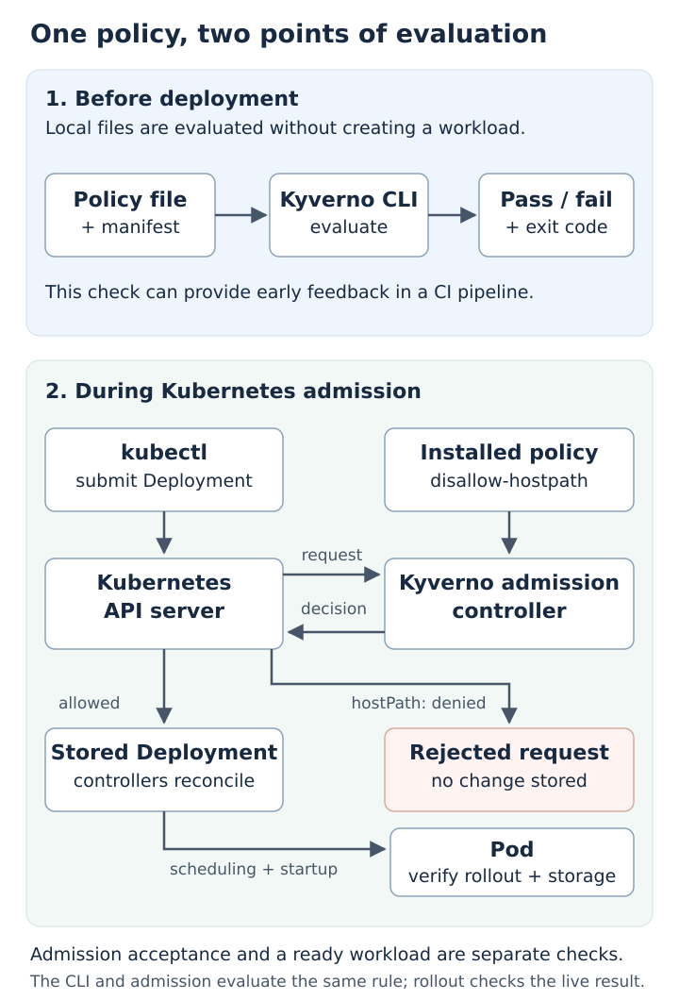

# Kubernetes Policy-as-Code with Kyverno

A Kubernetes manifest can be valid YAML while requesting access to sensitive files on a node. In this tutorial, a Deployment requests a read-only `hostPath` mount of the node's `/etc` directory. Read-only access still exposes the directory's contents.

We will test a policy before deployment, enforce it when matching requests reach Kubernetes, and correct the workload without weakening the policy. This connects early developer feedback, deployment controls and verification of a running workload.

## Intended learning outcomes

By the end of this tutorial, you should be able to:

1. Explain why Kyverno CLI checks before deployment and policy enforcement during admission are complementary controls.
2. Test allowed and denied Deployment manifests against the same policy, and distinguish a policy violation from a technical error.
3. Explain how the policy, kubectl, Kubernetes API server, Kyverno admission controller and workload controllers interact.
4. Correct the storage request, verify a ready workload, and explain the limits of this policy and the storage choice.

## The concepts behind the exercise

**Policy-as-code** means expressing rules in files that a tool can evaluate, instead of relying only on someone to inspect each change manually. A policy file defines what is allowed; a workload manifest describes what an application requests. Keeping both in Git lets a team review rule changes and test allowed and denied examples repeatedly. Here, the rule is: a Deployment's Pod template must not contain a `hostPath` volume.

**Kyverno** is a Kubernetes policy engine. It can validate resource configurations, mutate them and generate resources. This tutorial uses validation: the Kyverno CLI checks local manifests, and Kyverno's admission controller enforces the installed rule inside the cluster. Kyverno is the evaluator; `disallow-hostpath.yaml` supplies our rule.

**Admission control** is a checkpoint in the Kubernetes API request flow, after authentication and authorisation and before an accepted change is stored. For requests matching our policy, the API server calls Kyverno's validating webhook. Kyverno evaluates the requested Deployment and returns an allow or deny decision. A rejected creation request is not stored and does not create a Pod.

## Workflow and architecture



The CLI evaluates local files without creating workloads. In a CI pipeline, this could give feedback before a change is delivered; this tutorial runs that check in the browser terminal.

Admission is a separate control. The API server asks Kyverno to evaluate matching requests against the installed policy before accepting a change. A manifest submitted directly to the API server must pass that control even if the sender bypassed the CLI check.

After acceptance, Kubernetes controllers and the node bring the workload into its requested state. We verify that later stage rather than treating acceptance alone as proof that a Pod is running.

## What you will do

| Step | Action | Purpose |
| --- | --- | --- |
| 1 | Check the Kubernetes environment. | Establish that the cluster is ready. |
| 2 | Test both manifests with the Kyverno CLI. | Observe one denied and one allowed policy evaluation before deployment. |
| 3 | Install the policy and submit the violating manifest. | Observe admission rejection for the intended policy reason. |
| 4 | Deploy the corrected manifest and run all verifiers. | Confirm admission enforcement and one available workload together. |

The policy is a CEL-based Kyverno `ValidatingPolicy` named `disallow-hostpath`. It uses the `Deny` action and matches Deployment creation and updates across namespaces. It does not cover every workload kind or every security requirement. The filename `secure-deployment.yaml` means that the example satisfies this particular policy.

## Environment and prerequisites

You need a browser and basic familiarity with Kubernetes Deployments, Pods and YAML. Killercoda supplies a temporary single-node Kubernetes cluster and terminal. The exercise uses no cloud subscription, payment credentials or external secrets.

The automatic setup installs Kyverno and its CLI at version `1.19.1`, verifies the downloaded release files using SHA-256, waits for the controllers, and prepares the exercise files at:

```text
/root/kyverno-tutorial/kubernetes-policy-as-code
```

Wait until the terminal shows:

```text
[setup] Installation complete.
```

Then continue to step 1. If setup reports an error, inspect that error before running the exercises. Starting a fresh scenario gives you a new environment; setup should run automatically.

## Using the tutorial controls

Run commands in the Killercoda terminal using the command buttons or by copying only the command text. The action markers in the repository's Markdown are instructions to Killercoda and must be excluded from shell commands.

Steps 2-4 have a **CHECK** button. Each button runs the corresponding verification script; exit code `0` means that verification passed. An expected denial from Kyverno or kubectl can have exit code `1` while the verifier succeeds, because rejection is the intended result.

## References

- [Introduction to Kyverno](https://kyverno.io/docs/introduction/)
- [Kubernetes admission control](https://kubernetes.io/docs/reference/access-authn-authz/admission-controllers/)
- [Kyverno ValidatingPolicy](https://kyverno.io/docs/policy-types/validating-policy/)
- [Kubernetes admission webhooks](https://kubernetes.io/docs/reference/access-authn-authz/extensible-admission-controllers/)
- [Kubernetes volumes](https://kubernetes.io/docs/concepts/storage/volumes/)
